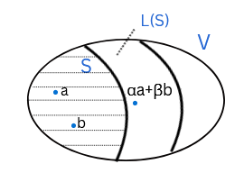
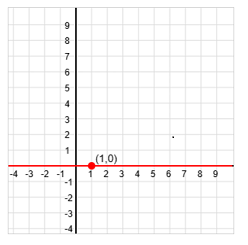
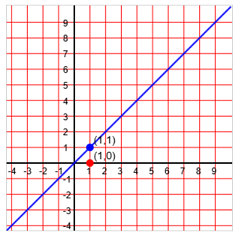

This experiment is designed to help students understand the concept of span, a fundamental idea in linear algebra. The span of a set of vectors refers to all linear combinations of those vectors and forms a subspace of the vector space and. This idea is important because it helps us understand the notion of a basis. By doing this experiment, students will be able to visualize the span of subsets of <i>R</i>2  and can extend this idea to other dimensions. Here <i>V</i> be a vector space over <i>F</i>≡<i>R</i> or <i>C</i> and let <i>S</i> be a subset of <i>V</i>.
<b>1. Linear combination:</b>
Let <i>x</i>1, <i>x</i>2, …, <i>x</i><i>k</i> &isin; <i>V</i> and <i>α</i>1, <i>α</i>2, ..., <i>α</i><i>k</i> &isin; F. Then <i>α</i>1<i>x</i>1+<i>α</i>2<i>x</i>2+ …+<i>α</i><i>k</i><i>x</i><i>k</i> is called a linear combination of <i>x</i>1, <i>x</i>2, …, <i>x</i>k. 
<b>2. Example:</b>
Consider the vector spaces <i>R</i>2 over <i>R</i>
   
Then some linear combinations of (3, 0), (1, 4)&isin;<i>R</i>2 are given below:  
Case (i). <i>α</i>1=2&isin;<i>R</i>, <i>α</i>2=1&isin;<i>R</i>  
<i>α</i>1<i>x</i>1+<i>α</i>2<i>x</i>2= 2(3, 0) +1(1, 4) =(6, 0)+(1, 4)=(7, 4)

Case (ii). <i>α</i>1=1&isin;<i>R</i>, <i>α</i>2=0&isin;<i>R</i>  
<i>α</i>1<i>x</i>1+<i>α</i>2<i>x</i>2= 1(3, 0) + 0(1, 4) = (3, 0)+(0, 0) = (3, 0)

Case (iii). <i>α</i>1=0&isin;<i>R</i>, <i>α</i>2=1&isin;<i>R</i>  
<i>α</i>1<i>x</i>1+<i>α</i>2<i>x</i>2= 0(3, 0)+1(1, 4)=(0, 0)+(1, 4)=(1, 4)

Case (iv). <i>α</i>1=-2&isin;<i>R</i>, <i>α</i>2=√2&isin;<i>R</i>  
<i>α</i>1<i>x</i>1+<i>α</i>2<i>x</i>2= -2(3, 0)+ √2(1, 4)=(-6, 0)+(√2, 4√2)=(√2-6, 4√2)
<b>3. Example:</b>
Consider the vector space (<i>P</i>2 (x), +, .) over <i>R</i> denoted by <i>P</i>2(<i>x</i>)  where <i>P</i>2(<i>x</i>)={ <i>a</i>2<i>x</i>2+<i>a</i>1<i>x</i>1+<i>a</i>0, where <i>a</i>1, <i>a</i>2, <i>a</i>0 &isin;<i>R</i> }.

The operation addition is defined as (<i>a</i>2<i>x</i>2+<i>a</i>1<i>x</i>1+<i>a</i>0)+(<i>b</i>2<i>x</i>2+<i>b</i>1<i>x</i>1+<i>b</i>0)={(<i>a</i>2+<i>b</i>2)<i>x</i>2+(<i>a</i>1+<i>b</i>1)<i>x</i>1+(<i>a</i>0+<i>b</i>0)};   where <i>a</i>0, <i>a</i>1, <i>a</i>2, <i>b</i>0, <i>b</i>1, <i>b</i>2&isin;<i>R</i>

And the operation scalar multiplication is defined as <i>α</i>.(<i>a</i>2<i>x</i>2+<i>a</i>1<i>x</i>1+<i>a</i>0)=<i>α</i>.<i>a</i>2<i>x</i>2+ <i>α</i>.<i>a</i>1<i>x</i>1+ <i>α</i>.<i>a</i>0&isin;<i>R</i>

Then <i>x</i>2+3<i>x</i>+3 &isin;<i>P</i>2(<i>x</i>) is a linear combination of <i>p</i>1=<i>x</i>+1, <i>p</i>2=<i>x</i>2+<i>x</i>+1, for <i>α</i>1=2&isin;<i>R</i>, <i>α</i>2=1&isin;<i>R</i>, s.t. 
<i>α</i>1<i>p</i>1+<i>α</i>2<i>p</i>2=2(<i>x</i>+1)+1(<i>x</i>2+<i>x</i>+1)=(2<i>x</i>+2)+ (<i>x</i>2+<i>x</i>+1)=<i>x</i>2+3<i>x</i>+3
<b>4. Linear span:</b>
Case (i). Let φ &ne; <i>S</i> &sube; <i>V</i>. Then the linear span of <i>S</i> consists of all possible linear combinations of elements of <i>S</i>.  It is denoted by <i>L</i>(<i>S</i>). Thus <i>L</i>(<i>S</i>)= { <i>α</i>1<i>x</i>1+ <i>α</i>2<i>x</i>2+ …+<i>α</i><i>k</i><i>x</i>k : <i>x</i>1, <i>x</i>2, ..., <i>x</i><i>k</i> &isin;<i>V</i>, <i>α</i>1, <i>α</i>2, …, <i>α</i><i>k</i> &isin;<i>F</i>}.

 
Case (ii). If <i>S</i>= φ, <i>L</i>(<i>S</i>) is defined to be {0}.
<b>5. Spanning set:</b>
If <i>L</i>(<i>S</i>)=<i>V</i>, that is if <i>V</i> is the linear span of <i>S</i>, then <i>S</i> is called a spanning set of <i>V</i> and it is said that <i>S</i> spans <i>V</i>.
 
<b>6. Example-I:</b>
Let <i>R</i>2 be the vector space over <i>R</i> where <i>S</i> &sube; <i>R</i>2. Then 
(i)	<i>S</i>={(1, 0)} does not span <i>R</i>2, i.e. <i>L</i>(<i>S</i>) &ne; <i>R</i>2
Justification: By definition, <i>L</i>(<i>S</i>)={<i>x</i>(1, 0)| <i>x</i>&isin;<i>R</i>}={(<i>x</i>, 0)| <i>x</i>&isin;<i>R</i>}. We show that (1, 1)  &notin;  <i>L</i>(<i>S</i>) because if not, then (1, 1) &isin; <i>L</i>(<i>S</i>) which implies (1, 1)=<i>α</i>(<i>x</i>, 0)=(<i>αx</i>, 0) i.e. 1=0, a contradiction. Thus (1, 1) &notin; <i>L</i>(<i>S</i>). Hence <i>L</i>(<i>S</i>) &ne; <i>R</i>2. In the adjoining figure (Fig. 1) red line represents the span of <i>S</i>.

 
<b>Fig. 1: <i>L</i>(<i>S</i>)=Red line</b> 

(ii)	<i>S</i>={(1, 1), (1, 0)} spans <i>R</i>2, i.e. <i>S</i> is a spanning set of <i>R</i>2, i.e. <i>L</i>(<i>S</i>)=<i>R</i>2.
Justification: By definition, <i>L</i>(<i>S</i>)={<i>x</i>(1, 0)+<i>y</i>(1, 1)| <i>x</i>, <i>y</i>  &isin;<i>R</i>}={(<i>x</i>, 0)+(<i>y</i>, <i>y</i>)| <i>x</i>, <i>y</i> &isin;<i>R</i>}={(<i>x</i>+<i>y</i>, <i>y</i>)| <i>x</i>, <i>y</i> &isin;<i>R</i>}.
Clearly <i>L</i>(<i>S</i>) &sube; <i>R</i>2. We show that <i>R</i>2 &sube; <i>L</i>(<i>S</i>). Let (<i>a</i>, <i>b</i>)  &isin;<i>R</i>2. Then (<i>a</i>, <i>b</i>)=<i>α</i>(1, 0)+<i>β</i>(1, 1) for some <i>α</i>, <i>β</i> &isin;<i>R</i>. Therefore <i>α</i>=<i>a</i>-<i>b</i> and <i>β</i>=<i>b</i>. Clearly <i>α</i>(1, 0)+<i>β</i>(1, 1)=(<i>a</i>, <i>b</i>). Thus (<i>a</i>, <i>b</i>) &isin;<i>L</i>(<i>S</i>). So that <i>R</i>2 &sube;<i>L</i>(<i>S</i>). Hence <i>L</i>(<i>S</i>)=<i>R</i>2. In the adjoining figure (Fig. 2) portion shaded by red lines represents the span of <i>S</i> which equals to <i>R</i>2 as (1, 0) is off the blue line spanned by (1, 1).

 
<b>Fig. 2: <i>L</i>(<i>S</i>)=Portion shaded by red lines=<i>R</i>2</b> 

(iii)	<i>S</i>={(1, 0), (2, 0)} does not span <i>R</i>2 i.e. <i>L</i>(<i>S</i>) &ne; <i>R</i>2.
Justification: By definition, <i>L</i>(<i>S</i>)={<i>x</i>(1, 0)+<i>y</i>(2, 0)| <i>x</i>, <i>y</i> &isin;<i>R</i>}={(<i>x</i>, 0)+(2<i>y</i>, 0)| <i>x</i>, <i>y</i> &isin;<i>R</i>}={(<i>x</i>+2<i>y</i>, 0)| <i>x</i>, <i>y</i>&isin;<i>R</i>}.
We show that (0, 1)  &notin; <i>L</i>(<i>S</i>). For if (0, 1)&isin;<i>L</i>(<i>S</i>), then (0, 1)=<i>α</i>(1, 0)+<i>β</i>(2, 0) for some <i>α</i>, <i>β</i>&isin;<i>R</i>. Therefore 1=0, a contradiction. Thus (0, 1) &notin; <i>L</i>(<i>S</i>). Hence <i>L</i>(<i>S</i>) &ne; <i>R</i>2

<b>7. Example-II:</b> 
i. Consider the vector space <i>P</i>2<i>x</i>  over <i>R</i> and let <i>S</i>={1, <i>x</i>+1, <i>x</i>2+<i>x</i>+1} &sube; <i>P</i>2<i>x</i> . Then <i>S</i> spans <i>P</i>2<i>x</i> , i.e. <i>L</i>(<i>S</i>)=<i>P</i>2<i>x</i> .

Justification: By definition, <i>L</i>(<i>S</i>)={<i>α</i>.1+<i>β</i>(<i>x</i>+1)+<i>γ</i>(<i>x</i>2+<i>x</i>+1): <i>α, β, γ</i> &isin;<i>R</i>}. Clearly <i>L</i>(<i>S</i>)  &sube;  <i>P</i>2<i>(x)</i> . To prove that <i>P</i>2<i>(x)</i> &sube; <i>L</i>(<i>S</i>). Let <i>a</i>2<i>x</i>2+<i>a</i>1<i>x</i>1+<i>a</i>0  &isin; <i>P</i>2<i>(x)</i> , where <i>a</i>0, <i>a</i>1, <i>a</i>2 &isin; <i>R</i>. Then <i>a</i>2<i>x</i>2+<i>a</i>1<i>x</i>1+<i>a</i>0=<i>α</i>.1+<i>β</i>(<i>x</i>+1)+<i>γ</i>(<i>x</i>2+<i>x</i>+1) for some <i>α</i>, <i>β</i>, <i>γ</i>  &isin; <i>R</i>. Therefore <i>α</i>=<i>a</i>0-<i>a</i>1, <i>β</i>=<i>a</i>1-<i>a</i>2 and <i>γ</i>=<i>a</i>2.
Clearly, <i>α</i>.1+<i>β</i>(<i>x</i>+1)+<i>γ</i>(<i>x</i>2+<i>x</i>+1)=<i>a</i>2<i>x</i>2+<i>a</i>1<i>x</i>1+<i>a</i>0. Thus <i>a</i>2<i>x</i>2+<i>a</i>1<i>x</i>1+<i>a</i>0 &isin; <i>L</i>(<i>S</i>), so that <i>P</i>2<i>(x)</i>  &sube; <i>L</i>(<i>S</i>). Hence <i>L</i>(<i>S</i>)= <i>P</i>2<i>(x)</i> .

ii. Consider the vector space <i>P</i>2<i>(x)</i>  over <i>R</i> and let
<i>S</i>={ <i>x</i>+1, <i>x</i>2+1, <i>x</i>-<i>x</i>2} &sube; <i>P</i>2<i>(x)</i> . Then <i>S</i> does not span <i>P</i>2<i>(x)</i> , i.e. <i>L</i>(<i>S</i>)  &ne; <i>P</i>2<i>(x)</i> .
Justification: By definition, <i>L</i>(<i>S</i>)={<i>α</i>(<i>x</i>+1)+<i>β</i>(<i>x</i>2+1)+<i>γ</i>(<i>x</i>-<i>x</i>2): <i>α</i>, <i>β</i>, <i>γ</i>  &isin; <i>R</i>}. We  show that 1 &notin;  <i>L</i>(<i>S</i>) because if not, then 1 &isin;<i>L</i>(<i>S</i>). Thus 1=<i>α</i>(<i>x</i>+1)+<i>β</i>(<i>x</i>2+1)+<i>γ</i>(<i>x</i>-<i>x</i>2) for some <i>α</i>, <i>β</i>, <i>γ</i>  &isin; <i>R</i>. Therefore <i>α</i>+<i>β</i>=1, <i>α</i>+<i>γ</i>=0, <i>β</i>-γ=0. By solving these equations, we get <i>α</i>+<i>β</i>=1and <i>α</i>+<i>β</i>=0, a contradiction. Thus 1 &notin;  <i>L</i>(<i>S</i>). Hence <i>L</i>(<i>S</i>)  &ne; <i>P</i>2<i>(x)</i>.

<b>8. Properties:</b>
(i) <i>S</i> is a subset of <i>L</i>(<i>S</i>).

(ii) <i>L</i>(<i>S</i>) is the smallest subspace of <i>V</i> containing <i>S</i>. Thus the smallest subspace of <i>V</i> containing φ is {0}.

(iii) Let <i>A</i> &sube; <i>B</i> &sube; <i>V</i>. Then <i>L</i>(<i>A</i>) &sube; <i>L</i>(<i>B</i>).
<b>9. Summary:</b>
For φ&ne;<i>S</i>&sube;<i>V</i>, <i>α</i>1<i>x</i>1+ <i>α</i>2<i>x</i>2+…+<i>α</i><i>k</i><i>x</i><i>k</i> is a linear combination of elements of <i>S</i>, where <i>x</i>1, <i>x</i>2, …, <i>x</i>k&isin;<i>S</i> and <i>α</i>1, <i>α</i>2, ..., <i>α</i><i>k</i>&isin;<i>F</i>: <i>L</i>(<i>S</i>) is the collection of all possible linear combinations of <i>S</i>. If <i>S</i>=φ, then <i>L</i>(<i>S</i>) is defined to be {0}. If <i>L</i>(<i>S</i>)=V, then <i>S</i> is called a spanning set of <i>V</i> and <i>S</i> is said to span <i>V</i>.

It may be noted that <i>L</i>(<i>S</i>)&ne;φ, S&sube;<i>L</i>(<i>S</i>) and <i>L</i>(<i>S</i>) is a subspace of <i>V</i>. Moreover, if <i>W</i> is a subspace of <i>V</i> such that <i>S</i>&sube;<i>W</i>, then <i>L</i>(<i>S</i>)&sube;<i>W</i>. In other words, <i>L</i>(<i>S</i>) is the smallest subspace of <i>V</i> containing <i>S</i>. A vector space <i>V</i> can have more than one spanning sets. For example, if we consider the vector space <i>R</i>2 over <i>R</i>, then both of {(1, 0), (0, 1), (2, 2)} and {(1, 2), (2, 3)} are its spanning sets. Indeed, one can construct infinitely many of its spanning sets.

